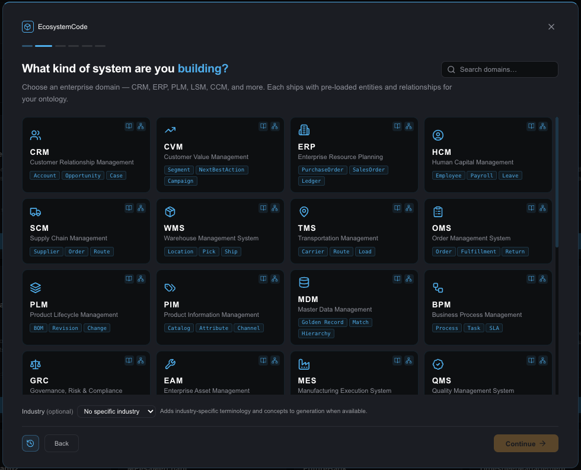
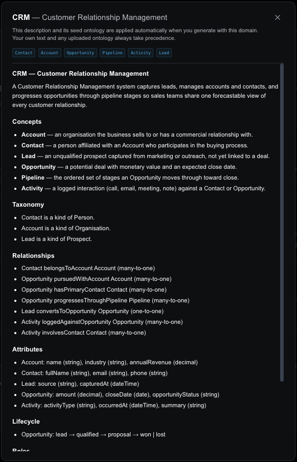

# ecosystem-domain-catalog

A **living catalog** of business-domain descriptions and seed ontologies: controlled
vocabulary (domain language), OWL/SKOS (RDF Turtle), and SHACL completeness shapes —
with industry overlays for banking, insurance, telco, healthcare, and gambling.

Built for **ontologists, taxonomists, knowledge-graph engineers, and domain experts**.
External products consume the same structure and headings; the published contract lives
in [`meta-data/`](meta-data/).

[](LICENSE)

## Why contribute

- Improve SKOS synonyms and definitions for existing classes
- Propose industry overlays that encode real regulatory and terminology differences
- Raise SHACL completeness where generated models need mandatory properties
- Add a missing business domain with a full seed ontology

See [CONTRIBUTING.md](CONTRIBUTING.md) and [meta-data/extension-approaches.md](meta-data/extension-approaches.md).

## Optional agents workbench

[`agents/`](agents/) is a Python 3.14 Catalog + Data workbench (search, map a MongoDB/PostgreSQL/DDL source, ask counts). It does not change this catalog’s contract. See [`agents/README.md`](agents/README.md).

## Standards stack

| Layer | Technology | Location |
|-------|------------|----------|
| Domain language | Markdown (7 sections) | `domains/{id}/description.md` |
| Vocabulary | OWL + SKOS (Turtle) | `domains/{id}/ontology.ttl` |
| Completeness | SHACL | `domains/{id}/shapes.ttl` |
| Industry specialization | Add-only overlays | `domains/{id}/industries/{industry}/` |
| Shared industry concepts | Turtle + Markdown | `industries/{industry}/` |
| Cross-domain identity | Core vocabulary + curated alignments | `core/ontology.ttl`, `core/alignments.ttl` |
| Discovery | JSON manifests | `index.json`, `industries.json` |

Design rules for integrators: **[meta-data/](meta-data/)**. Structural contract for agents/CI: **[AGENTS.md](AGENTS.md)**.

## Repository layout

```text
domains/{id}/           description.md · ontology.ttl · shapes.ttl · industries/…
industries/{id}/        industry.md · common.ttl
core/                   ontology.ttl (shared-entity vocabulary) · alignments.ttl (curated cross-domain links)
playbooks/              extension procedures
tools/validate-catalog.sh
meta-data/              published design rules (external products)
index.json · industries.json
```

## From ontology to SQL: where mappings fit

The ontology defines the **canonical business meaning** of concepts such as Customer,
Product, Account, Order and Interaction. A source mapping connects an implementation-specific
schema—SQL tables and columns, CSV fields, API properties or legacy-system identifiers—to
those canonical classes and properties.

Mappings are therefore the translation layer between semantic design and physical data:

~~~text
Domain language
  description.md
        ↓
Canonical semantic model
  ontology.ttl + shapes.ttl
        ↓
Optional industry specialization
  industries/{industry}/common.ttl
  domains/{domain}/industries/{industry}/overlay.ttl
        ↓
Source mapping
  domains/{domain}/mappings/generic-mapping.ttl
  domains/{domain}/industries/{industry}/mappings/generic-mapping.ttl
        ↓
Physical implementation
  SQL tables, columns, keys, views and rows
~~~

The mapping does **not** replace the ontology and does not make the SQL schema canonical.
It states how physical structures represent canonical meaning. Different source systems can
therefore integrate through the same domain vocabulary even when their table and column names
differ.

### Mapping levels

| Level | Purpose | Example location |
|---|---|---|
| Canonical ontology | Defines business classes, properties and relationships | domains/crm/ontology.ttl |
| Validation shapes | Defines required semantic completeness | domains/crm/shapes.ttl |
| Base source mapping | Aligns a generic or product-specific schema to a domain | domains/crm/mappings/generic-mapping.ttl |
| Industry mapping | Adds industry alignment without replacing the base mapping | domains/crm/industries/telco/mappings/generic-mapping.ttl |
| SQL example | Demonstrates tables, columns, keys and joins consumed by the mapping | domains/crm/industries/telco/mappings/sample.sql |
| Shared metadata | Documents mapping rules, templates and path patterns | meta-data/mappings/ |

### How a SQL schema is aligned

A mapping normally connects:

1. a table or view to an ontology class using **owl:equivalentClass** or a more conservative
   class relationship;
2. a column to an ontology property using **rdfs:subPropertyOf**;
3. a foreign key to an ontology relationship, including its expected domain and range;
4. source constraints and datatypes to SHACL validation expectations; and
5. source identifiers to stable IRIs so records from different systems can be joined safely.

For example, a source table named **customer_parties** may map to the canonical CRM customer
party class, while **customer_party_id** maps to its canonical identifier property. A foreign
key such as **subscription_ref** can map to the canonical relationship between a customer
relationship and a subscription. The SQL remains operational; the RDF mapping supplies the
shared meaning.

Load mappings in this order:

1. core and domain ontologies;
2. shared industry concepts and the selected domain overlay;
3. the base domain mapping;
4. the optional industry mapping; and
5. source data transformed into RDF or queried through a semantic or virtualization layer.

See [meta-data/mappings/README.md](meta-data/mappings/README.md) for authoring rules and
[meta-data/mappings/index.yaml](meta-data/mappings/index.yaml) for mapping path patterns.

## Domain language (seven headings)

1. Concepts · 2. Taxonomy · 3. Relationships · 4. Attributes · 5. Lifecycle · 6. Roles · 7. Primary workflow  

Details: [meta-data/domain-language.md](meta-data/domain-language.md).

## Validation

```bash
./tools/validate-catalog.sh
```

Must pass before every commit. Enforces structure, SKOS/SHACL minimums, SemVer format,
and **at least one industry overlay per domain**.

## Playbooks

- [playbooks/add-domain.md](playbooks/add-domain.md)
- [playbooks/extend-domain.md](playbooks/extend-domain.md)
- [playbooks/add-industry.md](playbooks/add-industry.md)
- [playbooks/add-industry-overlay.md](playbooks/add-industry-overlay.md)
- [playbooks/add-alignment.md](playbooks/add-alignment.md)

## Multi-domain composition (`core/`)

Projects can span several domains (e.g. CRM + CVM). Shared entities like **Customer**
must appear **once**, not per domain. `core/ontology.ttl` provides the canonical
common-entity vocabulary; `core/alignments.ttl` holds curated triples mapping domain
classes to it (`owl:equivalentClass` collapses, `rdfs:subClassOf` links a subtype).
Homonyms such as `crm:Account` (customer organisation) vs `fin:Account` (financial
account) are documented false friends and **never** aligned. Both files are consumed only
in multi-domain mode; single-domain generation is unchanged.
See [playbooks/add-alignment.md](playbooks/add-alignment.md) and
[meta-data/extension-approaches.md](meta-data/extension-approaches.md).

## Used by EcosystemCode

This catalog is used by [EcosystemCode](https://ecosystemcode.com) to ground domain
selection and seed ontologies when generating full enterprise systems. Contributors
improve the shared domain language and OWL/SKOS/SHACL assets that product experiences
can load at generation time.

Learn more about ontology-driven modeling on EcosystemCode:
**[Ontology & Semantic Modeling](https://ecosystemcode.com/features/ontology)**

Domain selection in the project wizard — each catalog domain ships pre-loaded entities
and relationships for the ontology:



Domain detail — the seven-section domain language and seed concepts applied during
system generation (user-provided text or ontologies still take precedence):



## License

Copyright 2026 Ecogenetic LLC. Licensed under the Apache License, Version 2.0 —
see [LICENSE](LICENSE).
